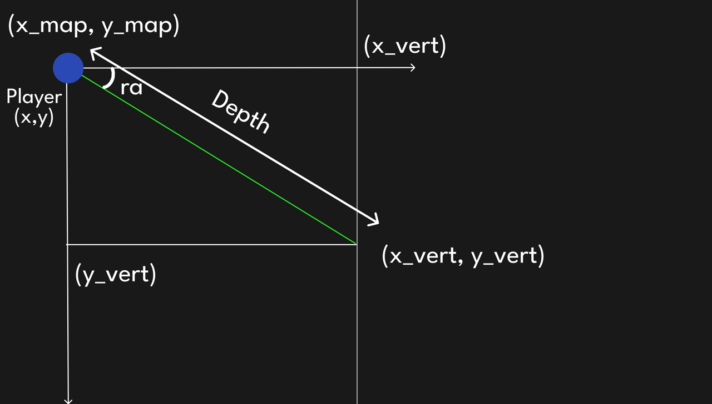
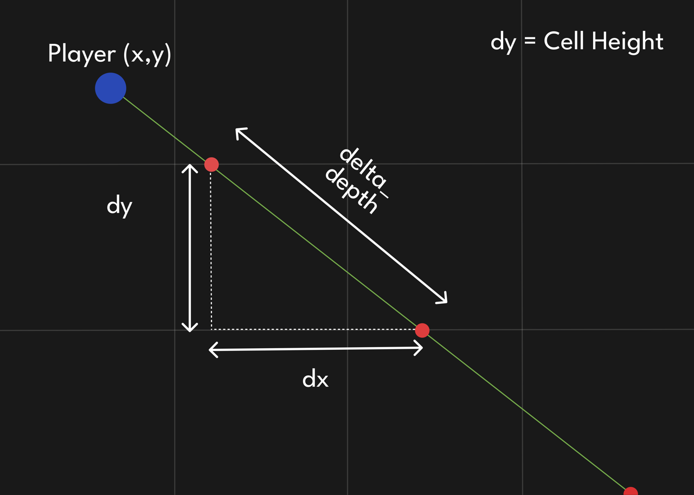
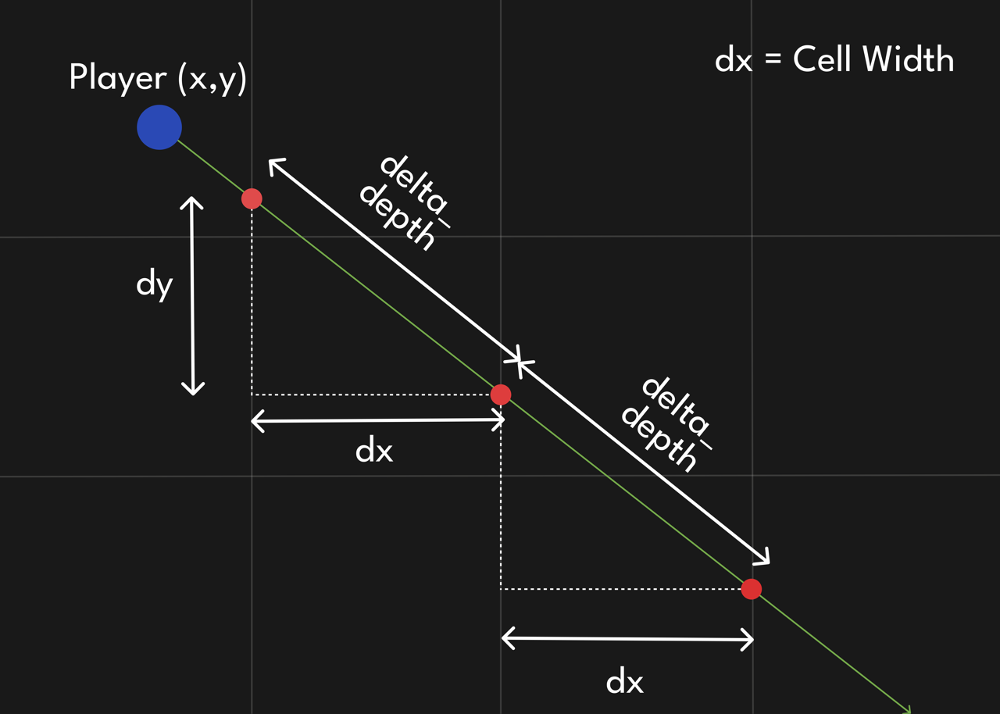
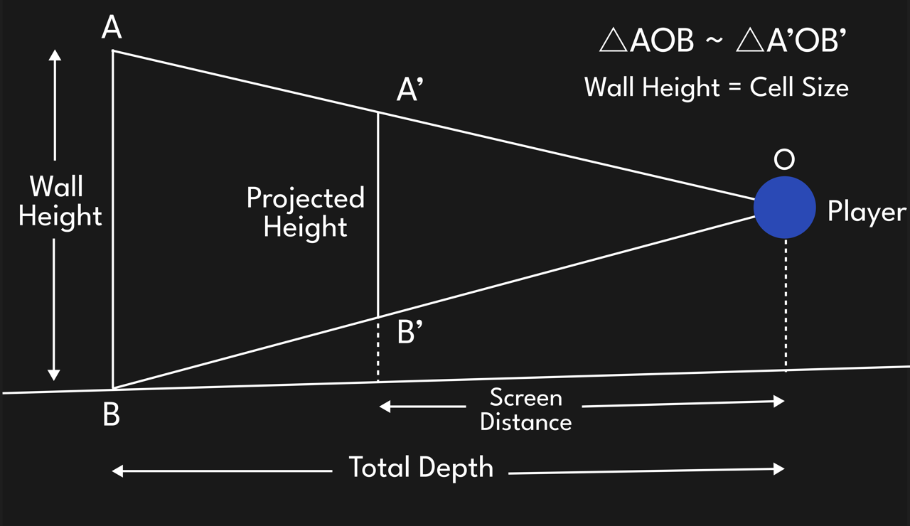
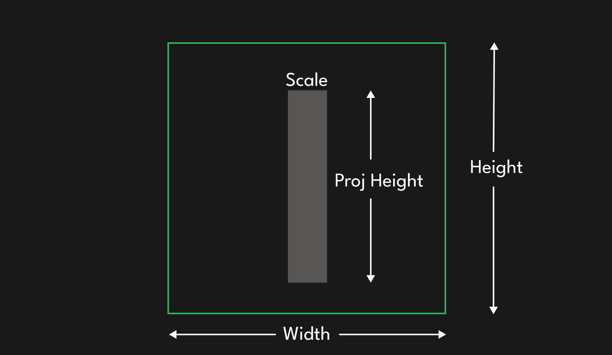

# Raycaster

This is an implementation of a simple raycaster which translates a 2D array map into a pseudo 3D scene inspired by early Wolfenstein Games.


## Demo

<p align="center">
  
</p>

## Explanation
In this raycaster, simple trigonometry is used to efficiently create a pseudo 3D scene.

### To check the horizontal and vertical intersection of the ray with the blocks

#### Intersection with Vertical Grid



$$depth = {x\\_vert - px \over cos(ra)}$$

$$y\\_vert = {y + depth \times sin(ra)}$$

By, this we can find the value of the first intercept with the grid.

Now to find the intercept with next grid, we can easily find the next intercept by adding the following values to the previous intercept.



To find the value of $delta\\_depth$, we can just use the following trigonometric operations.

$$dx = {CELL\\_SIZE}$$

$$cos(ra) = {dx \over delta\\_depth}$$

$$delta\\_depth = {dx \over cos(ra)}$$

$$dy = {delta\\_depth \times sin(ra)}$$

#### Intersection with Horizontal Grid

The same logic used to find the vertical intercept can also be used to find the horizontal intercept.

For horizontal intercept, the subsequent intercept would look something like this.



With this, we can check when the ray intersects a block of the grid. If it intersects a block, we can calculate the distance of the block from the player and draw the wall accordingly.

### Drawing the Wall

To draw the pseudo 3D scene, we need to find the projected height for each wall. To find the projected height, we first need to find the distance of that projected wall from the player.

This would look something like this.

#### Finding the Screen Distance


We have defined FOV as 60 degrees or PI/3 radians.

So,

$$tan(Half\\_fov) = {Half\\_width \over screen\\_dist}$$
$$screen\\_dist = {HALF_WIDTH \over tan(Half\\_fov)}$$

#### Finding the Projection Height

Now, to find the projected height of the wall, we can use similar triangle properties.



By similarity of triangles,

$${proj\\_height \over screen\\_dist} = {Wall\\_Height \over Depth}$$
$${proj\\_height} = {(Wall\\_height \times screen\\_dist) \over Depth}$$

#### Finally drawing the wall


We also need to define a scaling factor, which helps optimize the drawing of the wall.

Scale is defined as,
$$Scale = {Width \over Num\\_rays}$$

Now that we have the projected height, we can draw the walls using the following values,

```rust
    x = ray * SCALE
    y = HALF_HEIGHT - proj_height / 2
    width = SCALE
    height = proj_height
```
This can be better visualized as follows,


